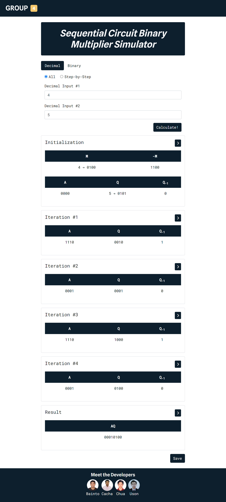
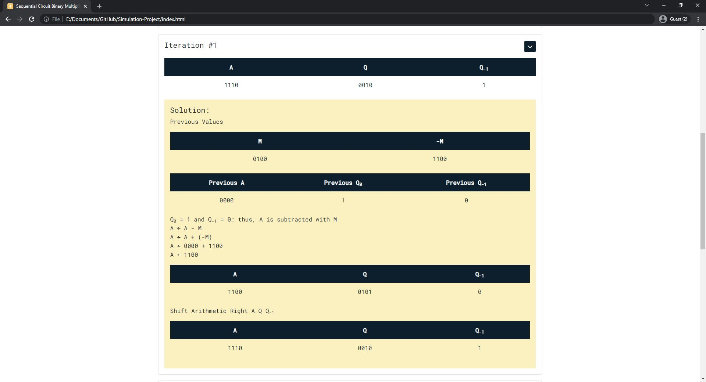
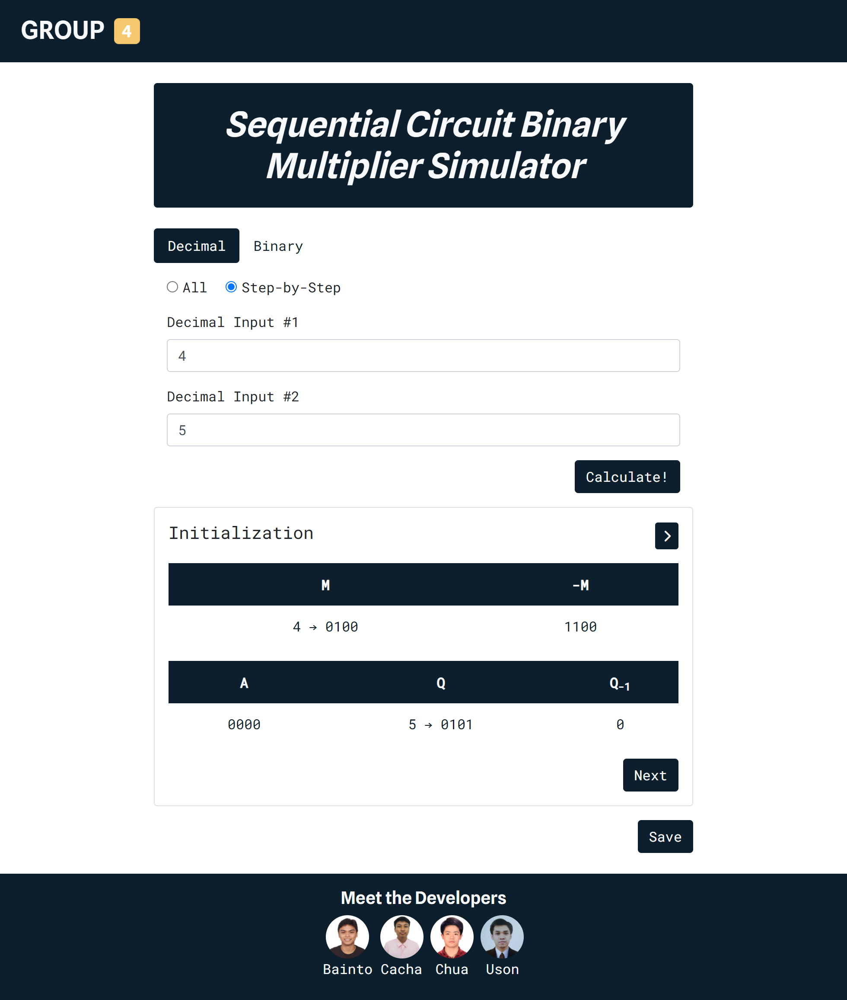
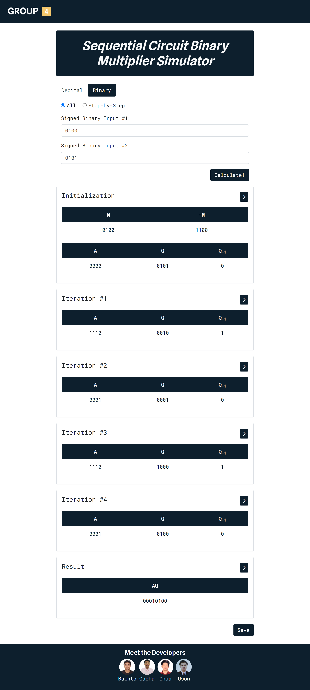
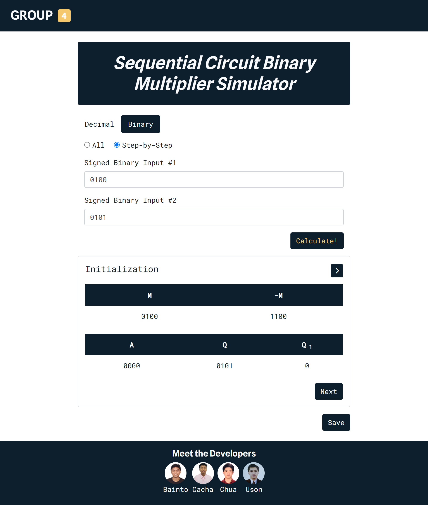

# Sequential Circuit Binary Multiplier

## Running the Application

1. Download the contents of the repository
2. Open the command prompt
3. Navigate to the project folder containing the repository
4. Run the command `npm install` to install the necessary modules
5. To run the server locally, run the command `npm start`
6. To run the application, go to `http://localhost:3000/` on a web browser
7. Alternatively, Steps 1 - 6 may be skipped and the deployed web application may be accessed directly through `https://csarch2-group-4.herokuapp.com/`

## Performing Calculations (Decimal Input, All)

1. Select the _Decimal_ option
2. Select the _All_ radio button
3. Enter the 1st and 2nd Decimal Input
4. Click on the _Calculate!_ button to perform the computation
5. Thereafter, the values of A, Q, and Q-1 after each iteration—including the initialization and the final result—will be shown 
6. In addition, the detailed solution for each step may be viewed by clicking on the _>_ icon located in the upper right corner of each section 
7. Lastly, the results may also be downloaded in a text file format by clicking on the save button located at the bottom of the page.

## Performing Calculations (Decimal Input, Step-by-Step)

1. Select the _Decimal_ option
2. Select the _Step-by-Step_ radio button
3. Enter the 1st and 2nd Decimal Input
4. Click on the _Calculate!_ button to perform the computation
5. Thereafter, only the initialization step will be shown 
6. Click on the _Next_ button to view the succeeding steps
7. In addition, the detailed solution for each step may be viewed by clicking on the _>_ icon located in the upper right corner of each section 
8. Lastly, the results may also be downloaded in a text file format by clicking on the save button located at the bottom of the page.

## Performing Calculations (Binary Input, All)

1. Select the _Binary_ option
2. Select the _All_ radio button
3. Enter the 1st and 2nd Binary Input
4. Click on the _Calculate!_ button to perform the computation
5. Thereafter, the values of A, Q, and Q-1 after each iteration—including the initialization and the final result—will be shown 
6. In addition, the detailed solution for each step may be viewed by clicking on the _>_ icon located in the upper right corner of each section 
7. Lastly, the results may also be downloaded in a text file format by clicking on the save button located at the bottom of the page.

## Performing Calculations (Binary Input, Step-by-Step)

1. Select the _Binary_ option
2. Select the _Step-by-Step_ radio button
3. Enter the 1st and 2nd Binary Input
4. Click on the _Calculate!_ button to perform the computation
5. Thereafter, only the initialization step will be shown 
6. Click on the _Next_ button to view the succeeding steps
7. In addition, the detailed solution for each step may be viewed by clicking on the _>_ icon located in the upper right corner of each section 
8. Lastly, the results may also be downloaded in a text file format by clicking on the save button located at the bottom of the page.
