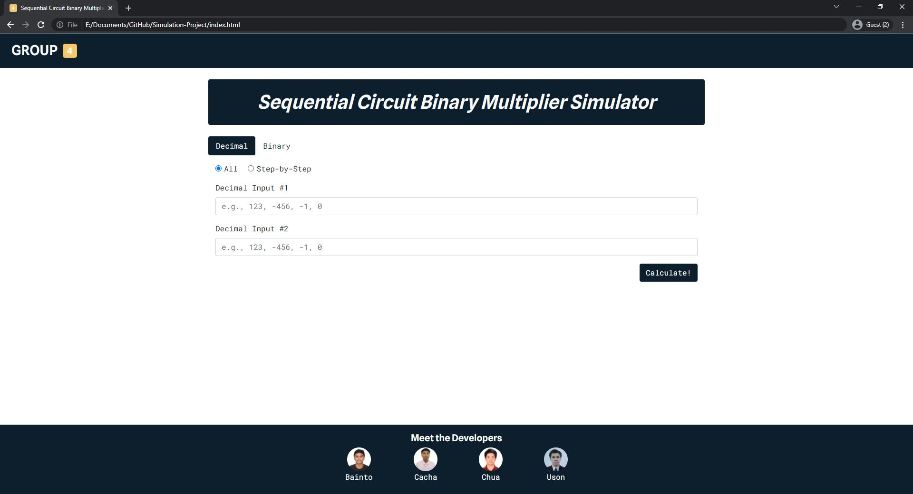

# Sequential Circuit Binary Multiplier

## Instructions to Start the Application

1. Open the `index.html` file to access the web application
2. Once `index.html`, the page below must be open 

## Performing Calculations (Decimal Input, All)

1. Select the _Decimal_ option
2. Select the _All_ radio button
3. Enter the 1st and 2nd Decimal Input
4. Click on the _Calculate!_ button to perform the computation
5. Thereafter, the values of A, Q, and Q-1 after each iteration—including the initialization and the final result—will be shown 
6. In addition, the detailed solution for each step may be viewed by clicking on the _>_ icon located on the upper right corner of each section 
7. Lastly, the results may also be downloaded in a text file format by clicking on the save button located on the bottom of the page.

## Performing Calculations (Decimal Input, Step-by-Step)

1. Select the _Decimal_ option
2. Select the _Step-by-Step_ radio button
3. Enter the 1st and 2nd Decimal Input
4. Click on the _Calculate!_ button to perform the computation
5. Thereafter, the initialization step will be shown 
6. In order to view the next step
7. In addition, the detailed solution for each step may be viewed by clicking on the _>_ icon located on the upper right corner of each section
8. Lastly, the results may also be downloaded in a text file format by clicking on the save button located on the bottom of the page.
